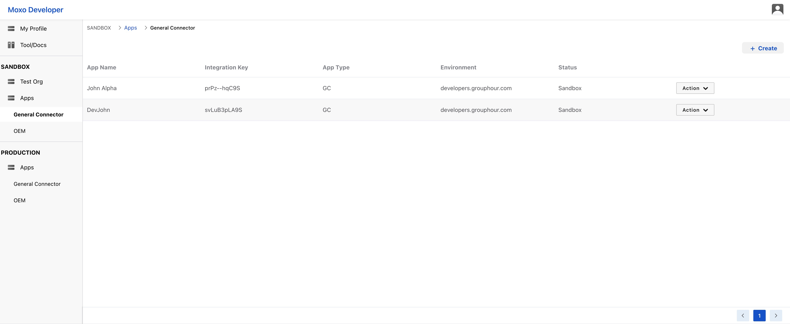
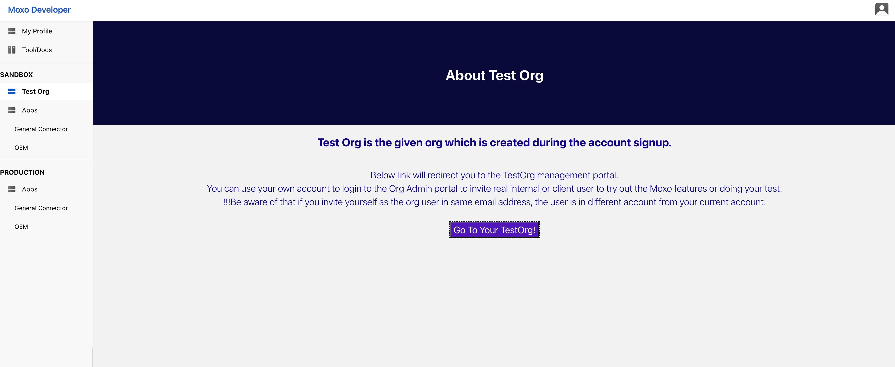
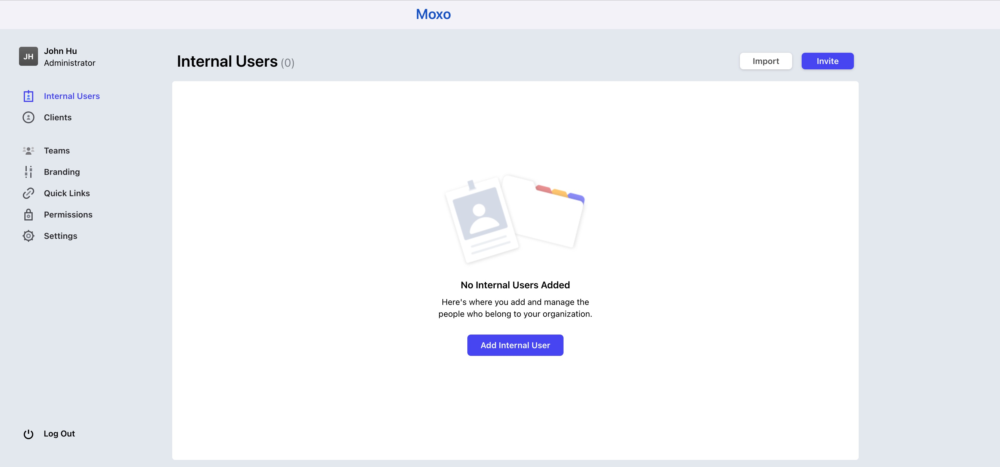
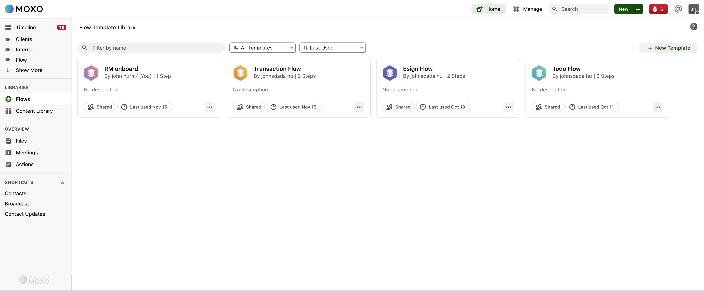
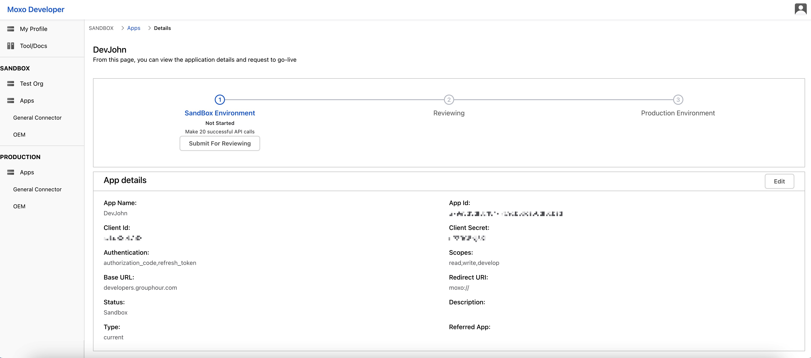

# XXX SDK Code Examples

This GitHub repo includes code examples for the XXX SDK. You could reference for below user cases:

* Internal user create flow conversation with customer
* Customer user open flow conversation

## Installation

### XXX Account Preparation

You can skip first two steps if you already have XXX acount and app created.

1. Go to `xxx.xxx.com` to have you XXX account registered.
2. Login to `xxx.xxx.com` to create app under console.
   
3. Login to admin console and create internal user and customer user in pair, so we could have flow conversation created between these two new users later.
   
   
4. Create new flow template in admin console. Flow template is pre-set , so internal users could pick one template to create same flow conversation easily.
   

After all this data set, we could go dive into code now!

### Prerequisites

1. Extract the Code Examples ZIP file or download or clone the code-examples-node repository.
2. Fill 'domain', 'client_id', 'client_secret', 'org_id', 'unique_id' in file `/code-examples/create_flow/HomePage.vue` or `code-examples/open_flow/main.vue`
   Second folder path depends which demo you want to experience.
   You could find this details in 'xxx.xxx.com', under detail page of the app you just created.
   
3. In your command-line environment, switch to the folder:
   `cd /code-examples/create_flow` or `cd /code-examples/open_flow`
   Second folder path depends which demo you want to experience.
4. To install dependencies, run: `yarn install`
5. Now you can run `yarn serve` to get demo run!

## License and additional information

### License

This repository uses the MIT License. See [LICENSE](./LICENSE) for details.
